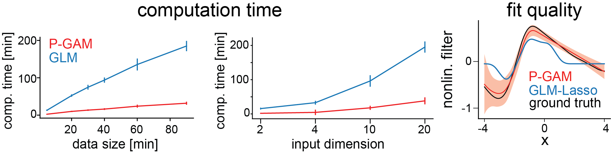

Poisson Generalized Additive Model (PGAM)
=====================================

## TODO:

- Basis: 
  - Write tests on new and old behavior 
  - FIX SPLIT BY for multiplicative!
- PGAM:
  - Define class API:
    - OPTION A:
      - fit, score, predict: receive a matrix of concatenated features
      - concat_fit, concat_score, concat_predict: receives the separate time series
      - Gets a basis as input
    - OPTION B:
      - receives the penalty tree, a map from tree to reg strength, a tree of regularization strength.
      - Implements solely the estimator API.

A PGAM for the efficient estimation of neural tuning functions. Responses are represented in terms of B-splines regularized by a smoothing enforcing penalization. B-spline coefficients and regularization hyperparameters are jointly learned from the data by numerical optimization of a cross-validation score. The model infers marginal confidence bounds for the contribution of each feature to the neural response and uses such bounds to identify the minimal subset of features each neuron responds to. This implies that the model selects a subset of variables based on statistical testing, as opposed to time costly forward-backward selection, that may be unfeasible when the number of regressors is large. See [[1]](#1) for a more technical details as well as benchmarking vs traditional regularized GLMs. 


  

<!-- <object data="figs/pgam-readme.pdf" type="application/pdf" width="2000px" height="700px">
    <embed src="figs/pgam-readme.pdf">
        <p>This browser does not support PDFs. Please download the PDF to view it: <a href="figs/pgam-readme.pdf">Download PDF</a>.</p>
    </embed>
</object> -->

<!-- add figure with the time of fit and a caption saying that for the GLM that entialed only the regularizer selection but not the covariate selection, while the GAM in that runtime does both regularizer and feature selection  -->


The repository includes two tutorials. The first (PGAM_tutorial) is intended to familiarize users with B-splines and the regularization used in the code. It is meant to showcase how the model/code works, conceptually. The second tutorial (Standardized_PGAM_Fit_with_examples) is more practical, meant to show how to work the code. It details standard inputs and outputs from the model, and how to run it.


Table of Contents
=================
* [Setup](#setup)
	* [Docker image](#docker-image)
		* [Download and run the PGAM Docker image](#download-run)
     	
		* [Working with jupyter](#working-with-jupyter)
     	
		* [Running a script](#running-a-script)
     	
	* [Conda environment](#conda-environment)
		* [Inspect and edit the PATH environment variable](#env-var)

* [Tutorials and Usage](#usage)

  
     		
* [References](#refs) 


# Setup <a name="setup"></a>
The package was implemented on macOS (Monterey version 12.5.1) and tested on Linux (RHEL version 8.4) and Windows 10. 
It requires python (>=3.6), and R (>= 3.6). 


Below we provide two recommended ways of setting up the package:

1. Download and run a [Docker image](#docker-image).
2. Install all software requirements and create a dedicated [conda environment](#conda-environment)


  
## Docker image <a name="docker-image"></a>

Downloading a Docker image and running it in a Docker container is very simple and makes the setup of the package trivial. However, working with docker containers requires some familiarity with the concept of docker container itself and the docker syntax (starting, stopping, and removing containers, mounting volumes, etc.); I would recommend checking out one of the many tutorials available online before starting to work with docker, for example https://www.youtube.com/watch?v=3c-iBn73dDE&t=2755s. <!--add hyperlink --> 

### Download and run the PGAM Docker image <a name="download-run"></a>


Download and install  <a href="https://docs.docker.com/get-docker/"> Docker<a>. 

Start Docker. 

Download the PGAM Docker image with the terminal/command prompt command

```
docker pull  edoardobalzani87/pgam:1.0
```

You can check the list of all the downloaded images with the command,
```
docker images
```

You can run the image in a Docker container and inspect the contents with the command,

```
docker run -ti  edoardobalzani87/pgam:1.0 /bin/bash
```
 
The command will run a Linux bash shell that allows you to inspect the image content. python, R, and all the required packages are already installed and the environment variables are set up. Type ```exit```, to exit the bash shell and stop the container. 

The ```run``` command creates a new container each time, however, if you haven't removed an old container, it can be restarted with the command ```docker start CONTAINER-ID```. Inspect the inactive containers with ```docker ps -a```. You can stop a container with  ```docker stop CONTAINER-ID```

You can delete a stopped container with the command  ```docker rm CONTAINER-ID``` . The container ID can be found with the command ```docker ps -a```, which will list all available containers, their IDs, the image that they run, and the command that they execute.

### Working with jupyter <a name="working-with-jupyter"></a>

To run the PGAM image in a container and launch jupyter notebook use the following command,

```
	docker run   -v your-notebook-folder:/notebooks -ti -p 8888:8888 edoardobalzani87/pgam:1.0
```

The -v option mounts the folder *your-notebook-folder*  on your computer as a volume in the Docker container virtual file system linking it to the virtual folder */notebook* .  

Files saved by the container in the */notebook* virtual folder will be automatically copied in *your-notebook-folder*, and files already present in *your-notebook-folder* will be automatically copied in */notebook* when the container is started. 

Files that the container saves in other directories of the virtual file system will be lost once the container is stopped or removed (the container as a temporary file system).

The -p *local-port:container-port* option connects port 8888 of the container with that of the host operating system, allowing the container and the operating system to interact.

Open a browser, and browse to 

```html
localhost:8888/
```

to connect to jupyter. You can test the library by working with the "PGAM Tutorial.ipynb" (see section below) or you can create your own notebook. Files will be stored in the *your-notebook-folder*.


### Running a script <a name="running-a-script"></a>

If you want to run *yourscript.py*  enter the code,

```
docker run -v your-script-folder/:/scripts -ti -p 8888:8888 edoardobalzani87/pgam:1.0 /bin/bash -c "python scripts/yourscript.py"
```

The -v option mounts *your-script-folder* as a volume in the container, and links it to the virtual folder */scripts*, while the -c option executes a shell command, in this case, *python yourscript.py*. 


Note that eventual the inputs loaded by *yourscript.py* needs to be saved in *your-script-folder* to be available within the container. Similarly, all the outputs that *yourscript.py* saves, must be saved in the virtual folder *scripts/* to be copied in the host file system.


## Conda environment <a name="conda-environment"></a>

Instruction on how to set up a conda environment with the specified packages are provided below.

1. Download  and install <a href="https://www.r-project.org/">R<a> and <a href="https://www.anaconda.com/products/distribution"> Anaconda <a>. Make sure that the path to R is in the system PATH environment variable after the installation, [add it otherwise](#env-var). 

2. Open the terminal/command prompt and create a conda environment with
	
	```
	conda create -n pgam python=3.9
	```

3. Activate the environment and install the required python packages

	```
	conda activate pgam
	conda install jupyter
	conda install numpy pandas dill scikit-learn matplotlib -y
	conda install seaborn pyyaml h5py numba -y
	pip install rpy2 opt_einsum statsmodels
	```

4. Install the R package *survey*. The recommended option is to install the package directly through rpy2 with the following steps:
	<ol type="a"; start="a">
  		<li>Run python, import r utils and install the package <em>survey</em>
  		</li>
  	</ol> 
  	
  	```
	python
  	from rpy2.robjects.packages import importr
  	utils = importr('utils')
  	utils.chooseCRANmirror(ind=1) # any CRAN mirror id
  	utils.install_packages('survey')
  	exit()
	```


Test the installation by *cd* to the *src/PGAM* directory and run,

```
	python
	from GAM_library import *
	exit()
```

### Inspect and edit the PATH environment variable <a name="env-var"></a>

On **windows**:
	
Inspect the PATH variable by entering the command prompt,

```
	echo %PATH:;=&echo.%
```
 
The R home folder should be listed  (usually *C:\R\R-version\\*).
 
 If not, edit the PATH variable (Windows 10):
 
 1. open the "Control Panel"
 
 2. search for "environment"
 
 3. click on "Edit the system environment variables"->"Edit variables..."
 
 4. scroll on "System variables" and click on "Path"
 
 5. click on "Edit..." -> "New", type the path to the R home folder and click "Ok".

 6. close the pop-up by clicking on "Ok"

 7. click "Apply" and then "Ok".

 8. restart the command prompt.


<br><br>
On **mac OS X** and **Linux**,

Inspect the PATH variable by entering in the terminal,
 
```
	echo $PATH | tr : '\n'
```
	

If the R home folder is not listed,

On **mac OS X**:

1. 	Open the .bash_profile file in your home directory (for example, /Users/your-user-name/.bash_profile) in a text editor.

2. 	Add <br>
	*export PATH="your-dir:$PATH"* <br>
	to the last line of the file, where your-dir is the R home directory.
	
3.	Save the .bash_profile file.

4.	Restart your terminal.
    
On **Linux**:

1.	Open the .bashrc file in your home directory (for example, /home/your-user-name/.bashrc) in a text editor.

2.	Add <br>
	*export PATH="your-dir:$PATH"* <br>
	 to the last line of the file, where your-dir is the R home directory.
	
3.	Save the .bashrc file.

4.	Restart your terminal.


# <a name="usage"> </a>Tutorials and Usage 

With the PGAM library, we provide two notebooks: 

1. <a href = "PGAM_Tutorial.ipynb">PGAM_Tutorial.ipynb </a>
2. <a href = "Standardized_PGAM_Fit_with_examples.ipynb"> Standardized\_PGAM\_Fit\_with\_examples.ipynb </a>

The  first notebook aims to introduce the user to some concepts of GAM theory and showcase how the PGAM library implements those concepts with the aim of estimating tuning functions from spike count vectors. The main functionality of the library will be detailed as well as the parameters and inputs that the PGAM needs to set up the model and learn the model parameters. 

With the second notebook we provide a standardized pipeline for fitting experimental data. We aim for it to be general, to require few programming skills, and to be easily parellelizable on High Performance Computing (HPC). We will detail how the user can run the pipeline through Docker (for local usage) and singularity (for HPC usage). The  singularity image can be downloaded <a href="https://osf.io/pcsav/">here</a>.


# References <a name="refs"></a>
<a id="1">[1]</a> 
<a href="https://proceedings.neurips.cc/paper/2020/hash/94d2a3c6dd19337f2511cdf8b4bf907e-Abstract.html">
Balzani, Edoardo , et al., 
"Efficient estimation of neural tuning during naturalistic behavior."
Advances in Neural Information Processing Systems 33 (2020): 12604-12614.<a>
